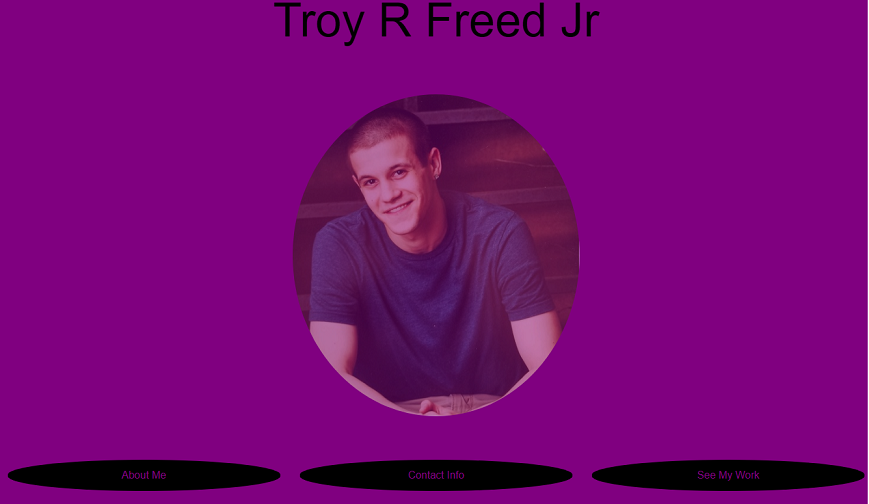
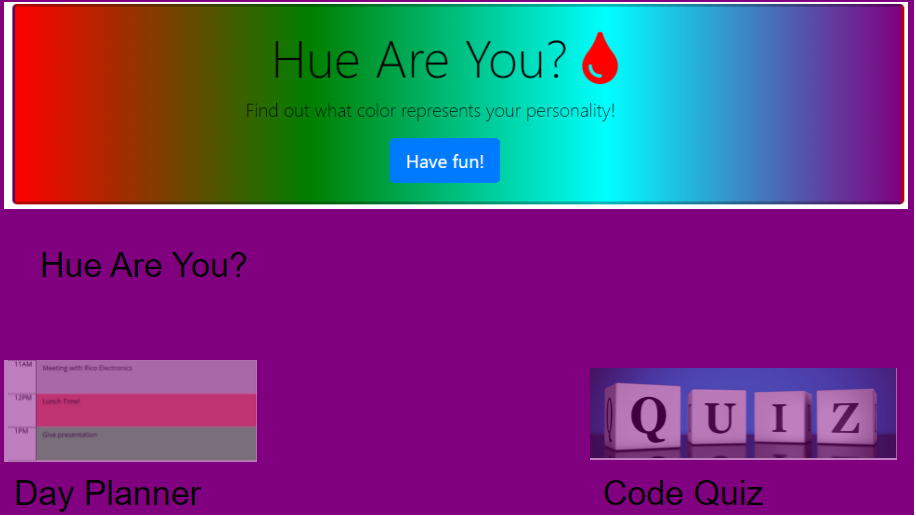

# My Portfolio
# Technologies Used
 HTML, CSS, and Bootstrap.

 # Contact Info
 tfreedwebdev94@gmail.com

# Description
I created a responsive webpage to display my portfolio. I have 4 separate pages in my portfolio. A homepage, with buttons to navigate through my site. An about me page, that describes who I am and my goals. A contact information page, that displays my LinkedIn and Github accounts, my mobile phone number, my resume, and my business e-mail. Lastly a work page, that displays my first group project and 2 of my best homework assignments so far in the course. 

# Screenshots

# Link To App
(https://tfreed94.github.io/VirtualPortfolio/)

# License
This project is license under the terms of the MIT license.